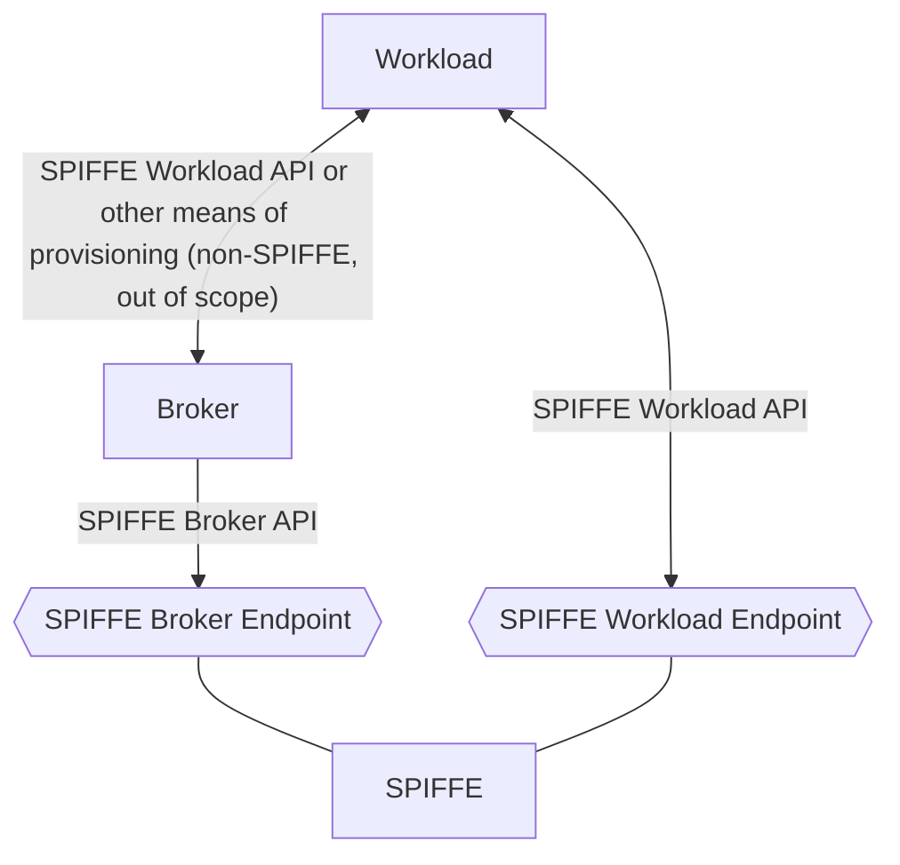

# The SPIFFE Broker Endpoint

## Status of this Memo

This document specifies an identity endpoint standard for the internet community, and requests discussion and suggestions for improvements. Distribution of this document is unlimited.

## Abstract

The SPIFFE Broker Endpoint is a dedicted endpoint for trusted infrastructure components in SPIFFE. It offers specific APIs that are not targeted to workloads but components in the infrastructure that can act on behalf of workloads and request corresponding SVIDs.

## Table of Contents

1\. [Introduction](#1-introduction)  
2\. [Accessibility](#2-accessibility)  
3\. [Transport](#3-transport)  
3.1. [Transport Security](#31-transport-security)  
4\. [Locating the Endpoint](#4-locating-the-endpoint)  
5\. [Authentication](#5-authentication)  
6\. [Error Codes](#6-error-codes)  
7\. [Extensibility and Services Rendered](#7-extensibility-and-services-rendered)  
Appendix A. [List of Error Codes](#appendix-a-list-of-error-codes)  

## 1. Introduction

Workloads today run on a variety of different platforms that each offer unique set of capabilities and limitations. The [SPIFFE Workload API](./SPIFFE_Workload_API.md) offers workloads a standardized way to retrieve SVIDs.

Since the introduction of SPIFFE and its Workload API new patterns arised where the workload itself is not requesting the SVID but a component doing it on-behalf-of the workload. This component either provisions the SVID to the workload in a way the workload understands, or, hooks into the network to perform transport layer security such as TLS outside of the workload. Service meshes are well-known for this pattern.

In the beginnings, the on-behalf-of component was a proxy running next to the workload. Each workload would have it's own peer-proxy and together they would form a combined security boundary. In this situation, the proxy was able to leverage the SPIFFE Workload Endpoint and API to retrieve SVIDs on behalf of the workload it shares the security boundary with. This pattern is commonly known as "sidecar pattern", the proxy as a "sidecar" or "sidecar proxy" 

Since this has been introduced, the pattern has evolved to locate the proxy from one per workload to one per node for security, separation of concern, maintenance and other reasons. The proxy that acts on-behalf of multiple workloads as “broker”. This pattern poses a conflict with the SPIFFE Workload API & Endpoint. The security boundary of the Broker and the workload is different, and thus the component that requests an SVID is not the workload, or a “workload specific” (sidecar) instance anymore but a broker that acts on-behalf of all the workloads running on the node. The SPIFFE of today would see the broker as the workload and not the workload the broker represents.

Another use case for the broker is a node agent placed in front of other, potentially multiple, node agents and routing requests. This can be for functional and non-functional reasons.

The following diagram illustrates the different endpoints and their audiences.

## 2. Accessibility

The SPIFFE Broker Endpoint SHOULD be exposed through a local endpoint, and implementers SHOULD NOT expose the same endpoint instance to more than one host. Additionally, its accessibility SHOULD be restricted to designated clients and SHOULD NOT be available to workloads.

## 3. Transport

The SPIFFE Broker Endpoint MUST be served over gRPC, and compliant clients MUST support gRPC. It may be exposed as either a Unix Domain Socket (UDS) or a TCP listen socket. Implementations SHOULD prefer Unix Domain Socket transport, however TCP is supported for implementations in which Unix Domain Sockets are impractical or impossible. TCP transport MUST NOT be used unless the underlying network allows the Workload Endpoint server to strongly authenticate the workload based on source IP address (e.g., over a localhost or link-local network), or other strong network-level assertions (e.g., via an SDN policy).

As a hardening measure against [Server Side Request Forgery](https://www.owasp.org/index.php/Server_Side_Request_Forgery) (SSRF) attacks, every client request to the SPIFFE Broker Endpoint MUST include the static gRPC metadata key `broker.spiffe.io` with a value of `true` (case sensitive). Requests not including this metadata key/value MUST be rejected by the SPIFFE Broker Endpoint (see the [Error Codes](#6-error-codes) section for more information). This prevents an attacker from exploiting an SSRF vulnerability to access the SPIFFE Broker Endpoint unless the vulnerability also gives the attacker control over outgoing gRPC metadata.

### 3.1 Transport Security

The SPIFFE Broker Endpoint requires transport security in the form of mutual TLS. Compared to the SPIFFE Workload Endpoint the broker and the implementation are expected to have a previously established root of trust in the form of SPIFFE bundles and X509-SVIDs. Effectively, this means that both parties need to make use of the SPIFFE Workload API as workloads first, before serving or connecting to the SPIFFE Broker Endpoint. Please see the [Authentication](#5-authentication) section for more information.

## 4. Locating the Endpoint

Clients may be explicitly configured with the socket location, or may utilize the well-known environment variable `SPIFFE_BROKER_SOCKET`. If not explicitly configured, conforming clients MUST fall back to the environment variable.

The value of the `SPIFFE_BROKER_SOCKET` environment variable is structured as an [RFC 3986](https://www.ietf.org/rfc/rfc3986.txt) URI. The scheme MUST be set to either `unix` or `tcp`, which indicates that the endpoint is served over a Unix Domain Socket or a TCP listen socket, respectively.

If the scheme is set to `unix`, then the authority component MUST NOT be set, and the path component MUST be set to the absolute path of the SPIFFE Workload Endpoint Unix Domain Socket (e.g. `unix:///path/to/endpoint.sock`). The scheme and path components are mandatory, and no other component may be set.

If the scheme is set to `tcp`, then the host component of the authority MUST be set to an IP address, and the port component of the authority MUST be set to the TCP port number of the SPIFFE Workload Endpoint TCP listen socket. The scheme, host, and port components are mandatory, and no other component may be set. As an example, `tcp://127.0.0.1:8000` is valid, and `tcp://127.0.0.1:8000/foo` is not.

## 5. Authentication and Authorization

The SPIFFE Broker Endpoint requires mutual authentication in the form of Mutual Transport Layer Security as defined in [RFC 5246](https://www.rfc-editor.org/rfc/rfc5246.txt) (TLS 1.2) and [RFC 8446](https://www.rfc-editor.org/rfc/rfc8446.txt) (TLS 1.3) in the form of X509-SVIDs. Prior to the mutual authentication both parties need to retrieve the SVID and bundle, for instance by using the SPIFFE Workload API.

The nature of the SPIFFE Broker Endpoint requires strong access control and only authorized callers must be allowed to connect. Controlling access only by accessibility is highly discouraged and implementors should restrict both, only making the endpoint accessible to allowed components and implementing strict access control on the endpoint. It is reccomended to base access control on the SPIFFE-ID of the client. Given the broad capabilities the SPIFFE Broker Endpoint offers to authorized clients the policy is reccommended to be static and based of configuration.

In addition, it is required to also perform server authentication on the broker in the form of validating the expected SPIFFE-ID of the SPIFFE provider. This is to prevent man-in-the-middle attacks where an attacker poses as a SPIFFE provider and returns poisened SVIDs or bundles to a legitimate broker.

## 6. Error Codes

A number of error conditions may be encountered by the client when interacting with the SPIFFE Broker Endpoint. For instance, the client request may have omitted the mandatory security header (see the Transport section for more information), or the SPIFFE Broker Endpoint implementation may still be initializing or otherwise unavailable.

Implementations receiving a client request that does not contain the mandatory security header MUST respond with gRPC status code "INVALID_ARGUMENT". Clients encountering the "INVALID_ARGUMENT" status code SHOULD NOT retry, as this indicates that an error has been made in the client implementation, and is not recoverable. 

In the event that the SPIFFE Broker Endpoint implementation is running but unavailable, for instance if it is still initializing or it is performing load shedding, clients will receive the gRPC status code "UNAVAILABLE". Clients receiving this code OR clients which are unable to reach the SPIFFE Workload Endpoint MAY retry with a backoff.

In situations where the client cannot be idenfied "UNAUTHENTICATED" is returned to clients. Clients should keep in mind that this is unlikely to be observed because authentication errors result in a rejected connection before the gRPC layer is initialized. Retries using the same certificate SHOULD NOT be made, instead clients should turn to the SPIFFE Workload API and refresh their credentials before retrying.

Clients that are not valid brokers and are not authorized are expected to observe "PERMISSION_DENIED". Clients receiving this code MAY retry with a backoff to allow for non-static policy at the server.

As a summary, the expected error codes are:

| Code | Condition | Client Behavior |
| ---- | --------- | -------- |
| INVALID_ARGUMENT | The gRPC security header is not present in the client request. Please see the [Transport](#3-transport) section for more information. | Report an error, don't retry. |
| UNAVAILABLE | The SPIFFE Broker Endpoint implementation is unable to handle the request. | Retry with a backoff. |
| UNAUTHENTICATED | Client cannot be identified. | Refresh credentials and retry  with a backoff. |
| PERMISSION_DENIED | Client is not authorized. | Report an error, don't retry. |
| NOT_FOUND | The workload the broker represents could not have been identified. | Verify existance, if positive retry with a backoff. |

## 7. Extensibility and Services Rendered

The SPIFFE Broker Endpoint may expose a variety of identity-related services, such as brokering or delegated issuance. Individual services are exposed through the use of the gRPC/Protobuf service primitive. A new (uniquely named) service must be introduced in order to extend the SPIFFE Broker Endpoint.

Since it is the promise of this specification to provide strong portability, the authors feel that allowing extension of existing logical services works against the spirit of SPIFFE. Should additional functionality be rendered by adding endpoints to existing logical services, a portability guarantee cannot be made in the event that a dependent workload moves from one SPIFFE-compliant environment to another. Instead, if use cases are identified that are common across all SPIFFE implementations changes should be made directly in SPIFFE to keep portability high.

While all SPIFFE Broker Endpoint implementations MUST expose the SPIFFE Broker API, it may at times be difficult to know what additional services are supported in a given environment. As a result, endpoint implementers SHOULD include support for [gRPC Server Reflection](https://github.com/grpc/grpc/blob/master/doc/server-reflection.md). If a client encounters an endpoint which does not support gRPC Server Reflection, it SHOULD assume that the only available services are those defined in the SPIFFE Broker API.
